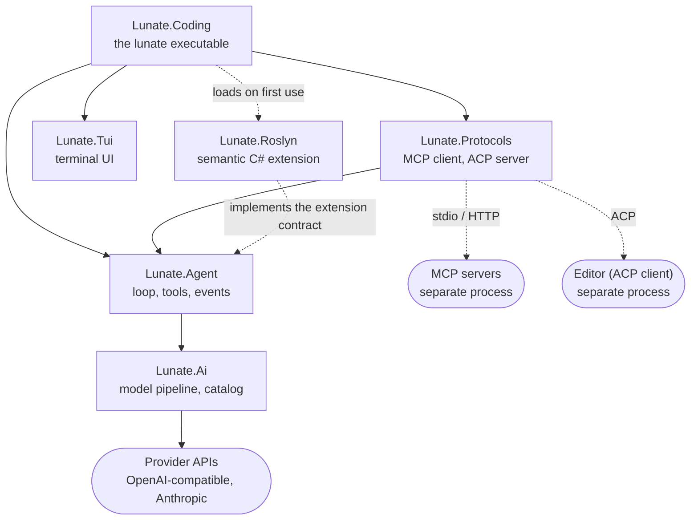
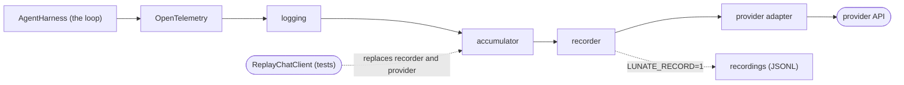
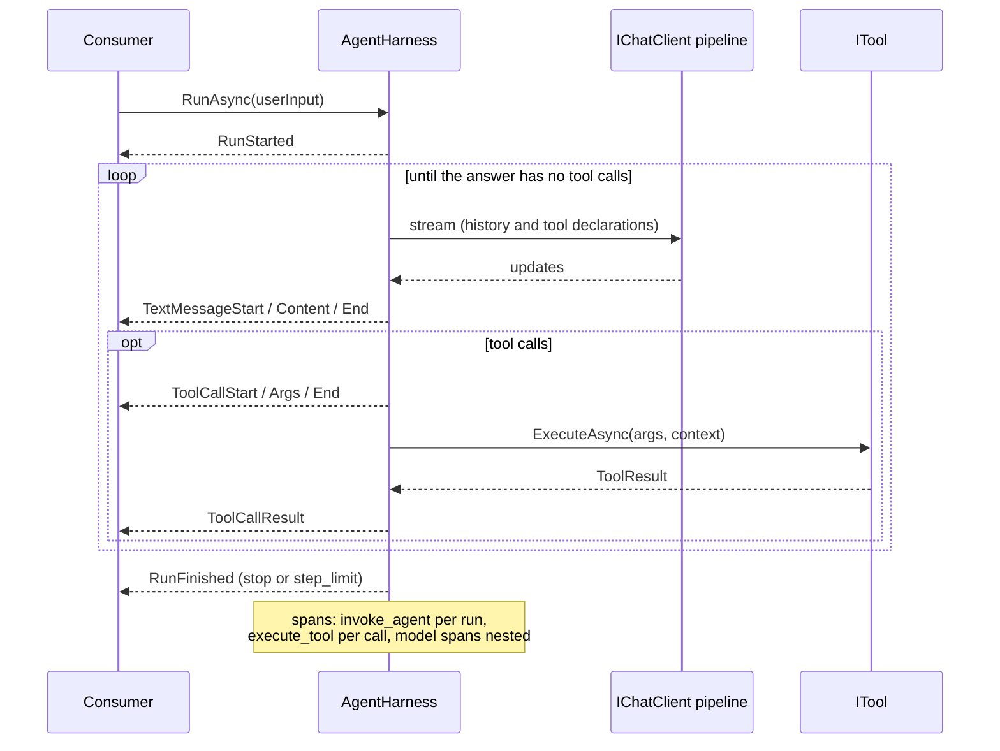
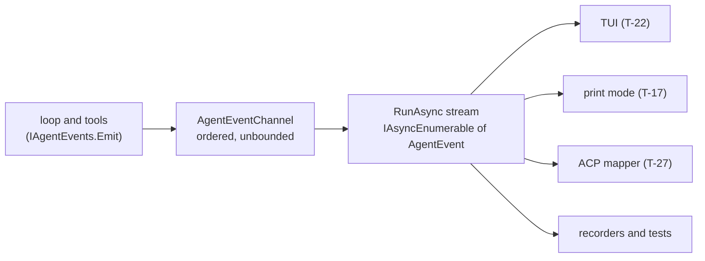

# Architecture

The visual overview of Lunate: what the pieces are, how a run flows, and where each detail lives. Each diagram stays small on purpose — it shows the shape, and links to the spec or ADR that owns the detail. A change that alters a pictured structure updates this page in the same change (see the `repo-quality` spec).

## System map

Arrows point from a project to what it depends on or calls; dashed edges are runtime-only connections — the lazily loaded extension and separate processes. `Lunate.Coding` is the composition root: it wires the TUI, the protocols and the agent, and loads `Lunate.Roslyn` on first use. The layering rule and its enforcement live in the [repo-foundation spec](../openspec/specs/repo-foundation/spec.md); the extension contract arrives with T-36 in the [guide](guide.md) (see the [extensibility spec](spec/extensibility.md)).

## The model pipeline

Order matters: telemetry is outermost (model spans see everything below it), then logging, the accumulator (consumers only ever see complete function calls), the recorder and the provider. Recording is opt-in via `LUNATE_RECORD=1`; replay replaces the recorder and the provider, so tests still run through telemetry, logging and the accumulator. Homes: [ai-layer spec](../openspec/specs/ai-layer/spec.md), [ADR-0002](../adr/0002-layering-and-meai-model-types.md), [ADR-0010](../adr/0010-anthropic-adapter.md).

## One run

`AgentHarness.RunAsync` is the only entry point; the consumer is the TUI, print mode, the ACP mapper or a test. The loop keeps going until a model answer has no tool calls or `MaxSteps` (default 50) is reached — then `StepLimitReached` and `RunFinished(step_limit)`. One `invoke_agent` span wraps the run; `execute_tool` spans hang off it; model-call spans nest under it. Homes: [agent-loop spec](../openspec/specs/agent-loop/spec.md), [ADR-0003](../adr/0003-loop-own-vs-maf-harness.md), [ADR-0012](../adr/0012-tool-contract.md), [ADR-0013](../adr/0013-agent-loop.md).

## The event path

Every event of a run — the loop and the tools alike — travels one ordered channel, and `RunAsync` exposes it as a stream. The TUI, print mode and the ACP mapper are consumers (later cards); tests record the same stream. Home: [agent-events spec](../openspec/specs/agent-events/spec.md); the AG-UI and ACP mapping table lives in the [guide](guide.md).
