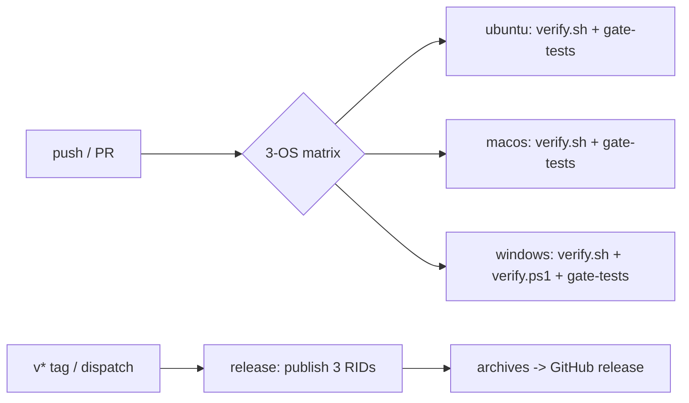

## Context

`repo-foundation` defined the gate; the `add-repo-skeleton` review deferred two items to this change: the gate's heavier failure modes (public-API diff, warnings-as-errors) and `verify.ps1` coverage. The guide's T-02 card sets the scope: build and test on three OSes, publish three targets, `scripts/perf.sh`; done when artifacts exist for all targets and CI turns red when a budget is exceeded.

CI flow (job level):

## Goals / Non-Goals

**Goals:**
- Every commit held to the full contract on all three target OSes.
- "CI turns red when a budget is exceeded" proven inside CI (gate self-tests).
- Release tags produce the three single-file binaries; a dry-run path proves artifact production without tagging.

**Non-Goals:**
- Branch protection rules, required reviews, scheduled nightly jobs.
- Contract tests against live model providers (no API keys in CI).
- Code signing or notarization of binaries (later distribution change).

## Decisions

- **GitHub Actions, per-OS matrix** (guide decision; public repo → free minutes). Alternative: single ubuntu runner with cross-builds — rejected: ReadyToRun does not cross-compile, and Windows/macOS behaviour must be exercised natively.
- **Each runner publishes its own RID** (`ubuntu→linux-x64`, `macos→osx-arm64`, `windows→win-x64`). The matrix pins RIDs deliberately instead of deriving them at runtime: `macos-latest` is arm64, so `osx-arm64` is the native runner target. Alternative: cross-publish — rejected (R2R does not cross-compile).
- **First-party actions only**: `actions/checkout`, `actions/setup-dotnet`, `actions/upload-artifact`, `actions/download-artifact`; release uploads via the preinstalled `gh` CLI. Alternative: marketplace release actions — rejected (minimal third-party surface).
- **CI budgets are calibrated per OS** (`linux-x64` 250 ms, `osx-arm64` 250 ms, `win-x64` 300 ms; measured first CI run: ubuntu 159 ms, macos 177 ms). CI runners are slower than dev machines; the local default stays 150 ms. Pending spike S-3, which replaces these placeholders with measured budgets. `BUDGET_MS` stays env-overridable per step.
- **NuGet caching** via `actions/setup-dotnet`'s cache option (or `actions/cache`), keyed on `global.json` and project files.
- **hyperfine installed per runner** (brew on macos; apt or pinned release binary on ubuntu; pinned release binary or choco on windows) — exact method finalized during implementation and pinned.
- **Release workflow has a dry-run dispatch path** so "artifacts for all targets" can be proven without creating a release.
- **Windows intentionally runs both gates**: the bash gate (Git Bash is present on runners) plus `scripts/verify.ps1` (pwsh) — closing the T-01 coverage gap. The duplication is deliberate; the two runners diverge on quoting and shell semantics, which is exactly where the first CI run failed.

## Risks / Trade-offs

- [Runner SDK or hyperfine availability drifts] → versions pinned; install steps fail loudly naming the tool; revisit when `global.json` moves.
- [macos runner architecture changes] → the matrix pins RIDs deliberately (`macos-latest` is arm64 today); a future runner-architecture change is the explicit signal to revisit the pinned RID.
- [Windows hyperfine install flakiness] → prefer a pinned release-binary download over package managers if needed.
- [Windows hyperfine/cmd parsing of quoted relative binary paths] → `scripts/perf.sh` preflights the binary directly, then runs hyperfine from the binary directory with an unquoted `./<name> --version` command and an absolute results path; `jq` is pinned as a release binary on the Windows runner instead of assumed present.
- [Matrix cost/latency] → public-repo minutes are free; keep jobs lean.

## Migration Plan

Not applicable — additive workflows; rollback removes the workflow files.

## Open Questions

- None blocking. Live-provider contract tests remain out of scope (no keys in CI).
