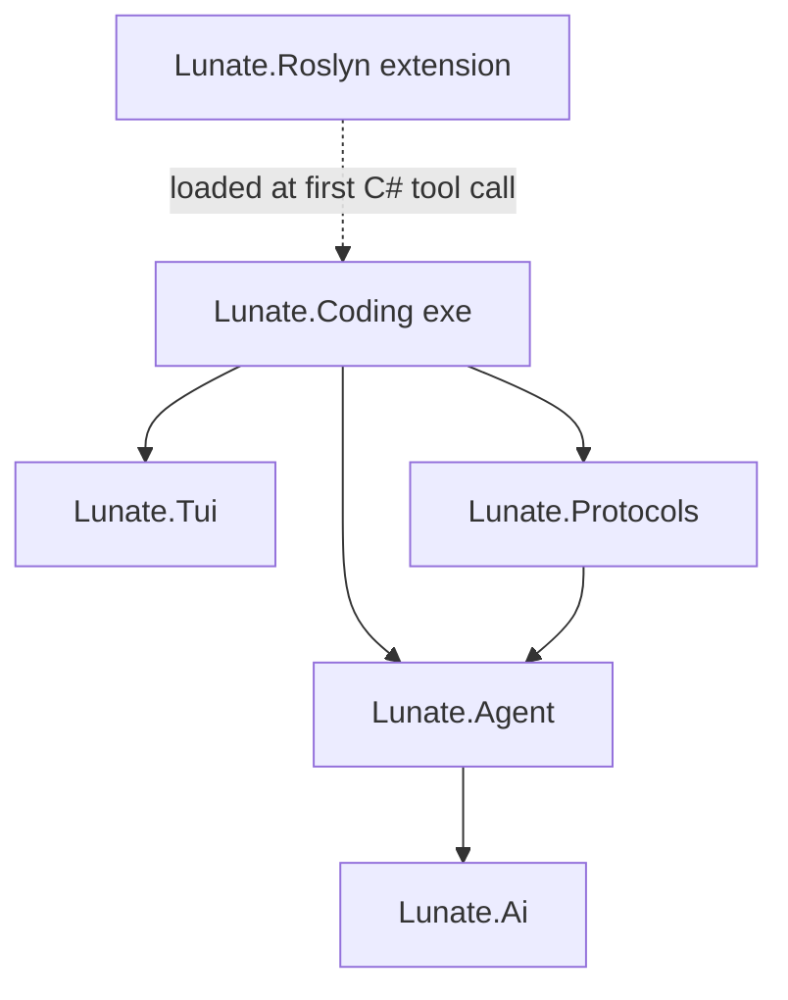

## Context

The repository currently holds the guide (`docs/guide.md`), the OpenSpec workflow and no code. This change (guide card T-01) creates the toolchain contract every later change builds on. No in-force ADRs exist yet; this change creates the first two durable ones.

Project graph (component level):

## Goals / Non-Goals

**Goals:**
- `scripts/verify.sh` green on the empty skeleton — the T-01 done-criterion.
- Enforce warnings-as-errors, layering, public API visibility, startup budget and formatting from commit one.
- Set the pattern every later change follows (build, tests, verification).

**Non-Goals:**
- CI workflows (T-02); any agent/provider/tool functionality (Phase 1+); a full Windows twin beyond `scripts/verify.ps1`.

## Decisions

- **TFM `net10.0`; SDK pinned in `global.json`** (`10.0.103`, `rollForward: latestFeature`). Alternatives: floating version — rejected; the pin keeps local and CI runs reproducible while allowing newer feature bands on runners.
- **Central build rules in `Directory.Build.props`**: nullable, `TreatWarningsAsErrors`, deterministic, code style enforced in build. Alternatives: per-project settings — rejected (drift).
- **Six source + six test projects**, empty, with one placeholder xUnit v3 test each so the runner is proven. Alternatives: a single test project — rejected; per-project isolation matches the guide layout.
- **Public API tracking** via `Microsoft.CodeAnalysis.PublicApiAnalyzers` on the four core libraries (`Ai`, `Agent`, `Protocols`, `Tui`) with empty baselines. `Lunate.Roslyn` is intentionally excluded because its surface is governed by the extension contract, not a library API; revisit in T-24 when the extension boundary is real. Alternative: start tracking later — rejected; an empty baseline is cheapest now.
- **`lunate --version` without System.CommandLine yet** — a tiny argument check in `Program.cs`; the CLI parser arrives with real commands (Phase 3). Alternative: add System.CommandLine now — rejected; keeps the skeleton dependency-light and the startup budget easy.
- **Architecture test** as a small pure checker over (project → `ProjectReference` list) in `tests/Lunate.Coding.Tests`, unit-tested against a synthetic violating graph and asserted against the real graph. Alternative: a reflection-based architecture library — rejected (extra package).
- **`verify.sh` pipeline**: build → test → publish (single-file, ReadyToRun, `RID` env) → `scripts/perf.sh` (hyperfine + jq, `BUDGET_MS`, default 150) → `dotnet format --verify-no-changes` → `git diff --exit-code -- '*PublicAPI.Shipped.txt'`. `verify.ps1` mirrors it. Alternatives: Cake/Nuke — rejected; plain scripts stay readable and CI-simple.
- **Gate self-tests** (`scripts/gate-tests.sh`): asserts `scripts/perf.sh` turns red on a deliberately low budget (`BUDGET_MS=1`) and green on a high one (`BUDGET_MS=999999`) against the published binary, and fails with a clear message when that binary is missing. The heavier `verify.sh` failure modes (public-API diff, warnings-as-errors) are exercised by the T-02 CI change instead, keeping the local self-test fast.
- **Platform-aware RID default**: the gate scripts (`verify.sh`, `perf.sh`, `gate-tests.sh`) share `scripts/lib.sh` and detect the host OS/arch for `RID` when not set (ReadyToRun does not cross-compile); CI passes `RID` per runner explicitly. Unsupported hosts fail with the remediation to set `RID` explicitly.
- **Budgets are placeholders** until S-3 calibrates (startup 150 ms). The idle-memory budget joins when the TUI exists; T-01 checks startup only.

## Risks / Trade-offs

- [First single-file publish may exceed the 150 ms placeholder on some machines] → S-3 calibrates; `BUDGET_MS` is env-overridable, CI is the strict gate.
- [SDK 10.0.103 forwards `dotnet test --nologo` to the MTP test host, so the handshake fails with "Zero tests ran" (exit 5; dotnet/sdk#55309)] → `verify.sh` / `verify.ps1` never pass `--nologo` to `dotnet test`; revisit when the `global.json` pin moves past 10.0.103.
- [dotnet format noise on a fresh repo] → `.editorconfig` kept close to SDK defaults; formatting issues are fixed during apply.
- [xUnit v3 runner details on .NET 10] → implementation follows current xUnit v3 guidance; placeholder tests prove the runner in apply.
- [Empty projects feel like ceremony] → that is exactly the T-01 contract; later changes extend instead of rebuild.

## Migration Plan

Not applicable — new repository; rollback is reverting the commits.

## Open Questions

- None blocking. Budget calibration lands with T-03 (S-3/S-4).
